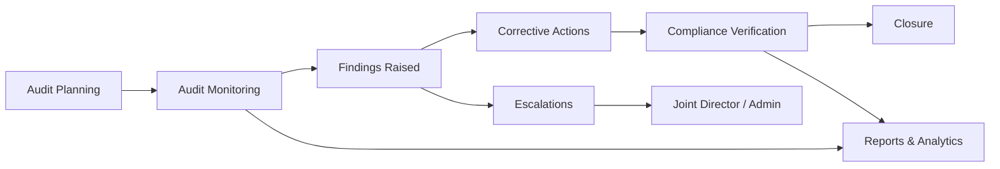

# Joint Director — Audit Module Documentation

> **Role:** `JointDirectorAudit`  
> **Base URL:** `/joint-director-audit`  
> **Layout:** `JointDirectorAuditLayout` → `CommonSidebar` + `CommonHeader` + `JointDirectorAuditRoutes`  
> **Last reviewed:** July 2026

---

## 1. What Is This Module?

The **Joint Director — Audit** portal is the oversight layer for a school ERP audit function. It sits above three audit sub-teams:

| Sub-team | Typical roles managed |
|----------|----------------------|
| **HR Audit** | HR Manager, HR Executive |
| **Process Audit** | Process Audit Manager, Process Audit Executive |
| **Quality Audit** | Quality Audit Principal, Quality Audit Executive |

The Joint Director Audit user **plans audits**, **monitors execution**, **tracks findings and compliance**, **reviews reports**, **assigns tasks**, **approves team requests**, **handles escalations**, and **communicates** via broadcasts and calendar.

This is currently a **frontend demo** — all pages use mock data from local `*Data.js` files (no live API integration yet).

---

## 2. Sidebar Navigation

All sidebar links are defined in `src/Common/CommonSidebar/Components/sidebarLinks.js` under `jointDirectorAuditSidebarLinks`.

| # | Sidebar Label | Route | Icon |
|---|---------------|-------|------|
| 1 | Dashboard | `/joint-director-audit/dashboard` | LayoutDashboard |
| 2 | Audit Planning | `/joint-director-audit/audit-planning` | ClipboardPen |
| 3 | Audit Monitoring | `/joint-director-audit/audit-monitoring` | ListChecks |
| 4 | Findings & Compliance | `/joint-director-audit/findings-compliance` | ShieldCheck |
| 5 | Reports & Analytics | `/joint-director-audit/reports-analytics` | BarChart3 |
| 6 | Task Management | `/joint-director-audit/task-management` | ClipboardList |
| 7 | Employee Management *(submenu)* | `#0` (parent) | UsersRound |
| 7a | → HR Manager | `/joint-director-audit/employee-management/hr-manager` | Users |
| 7b | → HR Executive | `/joint-director-audit/employee-management/hr-executive` | UserRound |
| 7c | → Process Audit Manager | `/joint-director-audit/employee-management/process-audit-manager` | ClipboardList |
| 7d | → Process Audit Executive | `/joint-director-audit/employee-management/process-audit-executive` | ListChecks |
| 7e | → Quality Audit Principal | `/joint-director-audit/employee-management/quality-audit-principal` | GraduationCap |
| 7f | → Quality Audit Executive | `/joint-director-audit/employee-management/quality-audit-executive` | BookOpenCheck |
| 8 | Request Approvals | `/joint-director-audit/request-approvals` | ClipboardCheck |
| 9 | Escalations | `/joint-director-audit/escalations` | ShieldAlert |
| 10 | Meetings & Calendar | `/joint-director-audit/meetings-calendar` | CalendarDays |
| 11 | Broadcast | `/joint-director-audit/broadcast` | Rss |

---

## 3. Full Route Map

Defined in `src/Routes/JointDirectorAuditRoutes.jsx`.

| Route | Page Component | Header Title |
|-------|----------------|--------------|
| `/joint-director-audit/dashboard` | `Dashboard` | Dashboard |
| `/joint-director-audit/audit-planning` | `AuditPlanningList` | Audit Planning |
| `/joint-director-audit/audit-planning/add-audit-plan` | `AddAuditPlan` | Add Audit Plan |
| `/joint-director-audit/audit-planning/view/:id` | `ViewAuditPlan` | View Audit Plan |
| `/joint-director-audit/audit-planning/edit/:id` | `EditAuditPlan` | Edit Audit Plan |
| `/joint-director-audit/audit-monitoring` | `AuditMonitoringList` | Audit Monitoring |
| `/joint-director-audit/audit-monitoring/view/:id` | `ViewAuditMonitoring` | Audit Monitoring Details |
| `/joint-director-audit/findings-compliance` | `FindingsComplianceList` | Findings & Compliance |
| `/joint-director-audit/findings-compliance/view/:id` | `ViewFinding` | Finding Details |
| `/joint-director-audit/reports-analytics` | `ReportsAnalytics` | Reports & Analytics |
| `/joint-director-audit/task-management` | `TaskManagement` | Task Management |
| `/joint-director-audit/task-management/add-task` | `AddTask` | Add Task |
| `/joint-director-audit/employee-management` | Redirect → `hr-manager` | — |
| `/joint-director-audit/employee-management/:roleKey` | `ViewEmployeeProfile` | *Role-specific profile title* |
| `/joint-director-audit/request-approvals` | `RequestApprovals` | Request Approvals |
| `/joint-director-audit/request-approvals/view-request` | `ViewRequestApproval` | View Request Details |
| `/joint-director-audit/escalations` | `Escalations` | Escalations |
| `/joint-director-audit/escalations/view-escalation/:id` | `ViewEscalation` | View Escalation Details |
| `/joint-director-audit/meetings-calendar` | `MeetingsCalendar` | Meetings & Calendar |
| `/joint-director-audit/broadcast` | `BroadcastList` | Broadcast |
| `/joint-director-audit/broadcast/add-broadcast` | `AddBroadcast` | Add Broadcast |
| `/joint-director-audit/broadcast/view-broadcast/:id` | `ViewBroadcast` | View Broadcast Details |
| `*` (fallback) | Redirect → dashboard | — |

---

## 4. Page-by-Page Breakdown

### 4.1 Dashboard
**Path:** `Dashboard/Dashboard.jsx` · **Data:** `dashboardData.js`

**Purpose:** Executive snapshot of the entire audit program.

**What's on the page:**
- **8 KPI cards:** Total Audits Scheduled, Audits In Progress, Completed Audits, Pending Findings, Open Compliance Actions, Critical Observations, Compliance Score (%), Overdue Actions
- **Audit Trends chart** (ECharts line): Monthly Audits Conducted, Findings Raised, Findings Closed (Jan–Jun)
- **Compliance Summary bar chart** by department (Operations, HR, Academic, Finance, Transport)
- **Upcoming Audits table:** Audit ID, Type, Department, Scheduled Date
- **Critical Findings table:** Finding ID, Department, Severity
- **Compliance Summary table** with progress bars per department

**Concept:** Single-pane-of-glass for audit health — planning volume, active work, open risk, and department compliance at a glance.

---

### 4.2 Audit Planning
**Paths:** `AuditPlanning/` · **Data:** `auditPlanningData.js`

| Screen | File | What it does |
|--------|------|--------------|
| List | `AuditPlanningList.jsx` | Filterable table of all planned audits |
| Add | `AddAuditPlan.jsx` | Create new audit plan via shared form |
| View | `ViewAuditPlan.jsx` | Read-only detail with Edit shortcut |
| Edit | `EditAuditPlan.jsx` | Update existing plan via shared form |
| Form | `Components/AuditPlanForm.jsx` | Reusable form for Add/Edit |

**List columns:** Audit ID, Title, Type, Department, Assigned Auditor, Priority, Scheduled Date, Status, Actions (View / Edit)

**Filters:** Search, Audit Type, Department, Status, From/To dates, Clear Filters, Export

**Audit types:** Process Audit, Quality Audit, HR Audit, Special Audit

**Departments:** Operations, HR, Academic, Finance, Transport, IT Support, Canteen, Housekeeping, Stationery Store

**Statuses:** Planned, In Progress, Completed

**Priorities:** Low, Medium, High, Critical

**View/Form sections:**
1. **Audit Information** — title, type, department
2. **Assignment** — assigned auditor, audit team
3. **Schedule** — planned date, expected completion, scheduled date
4. **Scope** — audit scope, objectives, checklist reference
5. **Priority** — priority level, status

**Concept:** Audit lifecycle starts here. The Joint Director defines *what* will be audited, *who* does it, *when*, and *why* (scope/objectives) before field work begins.

---

### 4.3 Audit Monitoring
**Paths:** `AuditMonitoring/` · **Data:** `auditMonitoringData.js`

| Screen | File | What it does |
|--------|------|--------------|
| List | `AuditMonitoringList.jsx` | Track in-flight audits |
| View | `ViewAuditMonitoring.jsx` | Detail with progress and activity |

**List columns:** Audit ID, Title, Department, Auditor, Progress %, Findings Raised, Pending Actions, Status, Actions (View)

**View sections:**
- Header with overall progress bar
- **Audit Information** — name, department, auditor
- **Progress** — completion %, findings count, pending actions, last update
- **Timeline / Notes** — execution milestones and auditor comments

**Monitoring statuses:** In Progress, On Hold, Completed, Overdue (from data)

**Concept:** Bridges planning and findings. Once an audit moves from "Planned" to active execution, this module tracks % completion and emerging issues in real time.

---

### 4.4 Findings & Compliance
**Paths:** `FindingsCompliance/` · **Data:** `findingsComplianceData.js`

| Screen | File | What it does |
|--------|------|--------------|
| List | `FindingsComplianceList.jsx` | All observations from audits |
| View | `ViewFinding.jsx` | Full finding lifecycle detail |

**List columns:** Finding ID, Audit ID, Department, Title, Severity, Responsible Person, Due Date, Status, Compliance Status, Actions (View)

**Filters:** Search, Department, Severity, Status, Compliance Status, date range

**Severity levels:** Critical, High, Medium, Low

**Finding statuses:** Open, In Progress, Closed, Overdue

**Compliance statuses:** Compliant, Non-Compliant, Pending Verification, Partially Compliant

**View sections:**
1. **Finding Details** — ID, audit link, department, title, severity, status, compliance, observation text
2. **Ownership & Timeline** — responsible person, raised date, due date, related audit
3. **Compliance** — compliance and finding status
4. **Corrective Action** — required action, action taken
5. **Closure** — closure notes

**Concept:** Every audit observation becomes a trackable finding with an owner, deadline, corrective action, and compliance verification — the core of audit remediation.

---

### 4.5 Reports & Analytics
**Path:** `ReportsAnalytics/ReportsAnalytics.jsx` · **Data:** `reportsAnalyticsData.js`

**Purpose:** Aggregated reporting across audits, findings, compliance, and risk.

**Filters:** Report period (Current Quarter, etc.), From/To dates, Export All Reports

**Report widgets:**

| Report | Columns |
|--------|---------|
| **Audit Summary Report** | Audit ID, Department, Type, Findings count, Status |
| **Findings Analysis Report** | Finding ID, Department, Severity, Status |
| **Compliance Performance Report** | Department, Total Findings, Closed, Pending, Compliance % |
| **Recurring Issues Report** | Department, Issue Type, Occurrences |
| **Risk Analysis Report** | Risk Area, Department, Severity, Status |

**Concept:** Turns operational audit data into management intelligence — spot repeat problems, measure department compliance, and prioritize risk areas.

---

### 4.6 Task Management
**Paths:** `TaskManagement/` · **Data:** `taskData.js`

| Screen | File | What it does |
|--------|------|--------------|
| List | `TaskManagement.jsx` | Assign and track audit-team tasks |
| Add | `AddTask.jsx` | Create new task with attachments |

**List columns:** Task ID, Title, Description, Assigned To, Department, Priority, Assigned Date, Due Date, Status, Actions (View / Edit / Delete via modals)

**Filters:** Search, Assigned To, Status, date range

**Shared components:** `EditRequestModal`, `DeleteRequestModal`, `ExportModal`, `AttachmentsUpload`

**Concept:** Operational task delegation within the audit org — separate from audit findings but supports day-to-day audit program work.

---

### 4.7 Employee Management
**Path:** `EmployeeManagement/ViewEmployeeProfile.jsx` · **Data:** `employeeData.js`

**Purpose:** View profile dashboards for each audit sub-team role (no separate list page — sidebar links go directly to role profiles).

**Supported role keys:**

| Role Key | Sidebar Label | Employee ID (demo) |
|----------|---------------|-------------------|
| `hr-manager` | HR Manager | HRM-1001 |
| `hr-executive` | HR Executive | HRE-1001 |
| `process-audit-manager` | Process Audit Manager | PAM-1001 |
| `process-audit-executive` | Process Audit Executive | PAE-1001 |
| `quality-audit-principal` | Quality Audit Principal | QAP-1001 |
| `quality-audit-executive` | Quality Audit Executive | QAE-1001 |

**Profile sections:**
- **Hero header** — photo, name, role, attendance rate
- **Personal Information** — DOB, gender, blood group, address, contact
- **Professional Information** — designation, department, qualifications, experience
- **Employment Information** — joining date, employment type, reporting manager
- **Account Details** — user ID, login credentials summary
- **Documents** — uploaded document list
- **Attendance Records** — daily check-in/out with status badges (Present, Absent, Leave, Half Day)
- **Recent Tasks** — task list with status badges

**Concept:** Joint Director can inspect any direct-report audit team member's profile, attendance, and workload without leaving the audit portal.

---

### 4.8 Request Approvals
**Paths:** `RequestApprovals/` · **Data:** `requestApprovalData.js`

| Screen | File | What it does |
|--------|------|--------------|
| List | `RequestApprovals.jsx` | Pending/approved/rejected requests from audit teams |
| View | `ViewRequestApproval.jsx` | Detail with Approve / Reject actions |

**Request types:** Financial Request, General Request

**List columns:** Request ID, Type, Purpose, Requested By, Department, Amount (financial), Request Date, Status, Actions (View)

**Budget threshold:** ₹75,000 (`BUDGET_THRESHOLD`) — requests above this may need special handling in the view

**View sections:**
- Request information (ID, type, date, status, requester, department)
- Financial details (amount, items, budget flag) *or* general request details
- Description and remarks
- **Actions:** Approve / Reject (shown when status is Pending)

**Concept:** Audit team members submit financial and operational requests upward; Joint Director Audit is the approval authority before Admin or finance processing.

---

### 4.9 Escalations
**Paths:** `Escalations/` · **Data:** `escalationData.js`

| Screen | File | What it does |
|--------|------|--------------|
| List | `Escalations.jsx` | Issues escalated from audit managers/executives |
| View | `ViewEscalation.jsx` | Detail with escalation actions |

**List columns:** Escalation ID, Escalated By, Department, Description, Date, Priority, Status, Actions (View)

**Escalation departments:** HR Audit, Process Audit, Quality Audit

**Statuses:** Open, In Review, Escalated to Admin, Resolved, Closed

**Source types:** From audit managers or audit executives (lower hierarchy)

**View actions:**
- **Escalate to Admin** — when not yet forwarded and not resolved/closed
- **Mark Resolved** — when Open or In Review

**Concept:** When audit teams hit blockers (disputed findings, missing cooperation, critical non-compliance), they escalate to Joint Director Audit, who can resolve locally or push to Admin.

**Escalation flow:**
```
Audit Executive → Audit Manager → Joint Director Audit → Admin (optional)
```

---

### 4.10 Meetings & Calendar
**Path:** `MeetingsCalendar/MeetingsCalendar.jsx` · **Data:** `meetingEventData.js`

**Implementation:** Wraps shared `Common/MeetingsCalendar/MeetingsCalendar` with audit-specific seed events.

**Demo events include:**
- Audit Team Weekly Sync
- Process Audit Planning — Finance
- HR Audit Compliance Briefing
- Quality Audit — Academic Standards Review

**Concept:** Coordinate audit team meetings, planning sessions, and compliance briefings in a shared calendar UI.

---

### 4.11 Broadcast
**Paths:** `Broadcast/` · **Data:** `broadcastData.js`

| Screen | File | What it does |
|--------|------|--------------|
| List | `BroadcastList.jsx` | All sent announcements |
| Add | `AddBroadcast.jsx` | Compose new broadcast with attachment |
| View | `ViewBroadcast.jsx` | Read broadcast detail |
| Upload | `Components/AttachmentUpload.jsx` | PDF attachment helper |

**Categories:** Audit Operations, Policy Update, Audit Team Notice, Compliance Alert, General Announcement

**Visible-to options:** All Audit Team, HR/Process/Quality Audit Team, individual role targets

**List columns:** Broadcast ID, Title, Category, Message preview, Sent By, Date, Attachment, Actions (View / Edit / Delete)

**Concept:** One-to-many communication from Joint Director Audit to audit sub-teams — schedules, policy changes, compliance alerts.

---

## 5. Core Concepts & Workflows

### 5.1 Audit Lifecycle



1. **Plan** — Define audit scope, team, schedule (`Audit Planning`)
2. **Execute & Monitor** — Track progress during field work (`Audit Monitoring`)
3. **Record Findings** — Log observations with severity and owners (`Findings & Compliance`)
4. **Remediate** — Assign corrective actions, verify compliance
5. **Report** — Aggregate into summary, risk, and compliance reports (`Reports & Analytics`)
6. **Escalate** — Unresolved or critical items bubble up (`Escalations`)

### 5.2 Hierarchy & Governance

```
Admin
  └── Joint Director — Audit  ← this module
        ├── HR Audit (Manager + Executive)
        ├── Process Audit (Manager + Executive)
        └── Quality Audit (Principal + Executive)
```

- **Request Approvals** — teams request resources/permissions upward
- **Escalations** — teams escalate blockers upward
- **Broadcast** — Joint Director pushes directives downward
- **Task Management** — Joint Director assigns work across teams
- **Employee Management** — visibility into team member profiles

### 5.3 Data Model (Demo)

Each feature area has a dedicated data file with mock records and helper functions:

| Data File | Key Exports |
|-----------|-------------|
| `dashboardData.js` | KPI_CARDS, UPCOMING_AUDITS, CRITICAL_FINDINGS, COMPLIANCE_SUMMARY, AUDIT_TRENDS |
| `auditPlanningData.js` | AUDIT_PLANS, getAuditPlanById(), AUDIT_TYPES, DEPARTMENTS, AUDITORS |
| `auditMonitoringData.js` | AUDIT_MONITORING, getAuditMonitoringById() |
| `findingsComplianceData.js` | FINDINGS, getFindingById() |
| `reportsAnalyticsData.js` | 5 report datasets, REPORT_PERIODS |
| `taskData.js` | TASKS, ASSIGNEE_OPTIONS, STATUS_OPTIONS |
| `employeeData.js` | EMPLOYEE_PROFILES (keyed by roleKey) |
| `requestApprovalData.js` | REQUESTS, REQUEST_TYPES, BUDGET_THRESHOLD |
| `escalationData.js` | ESCALATIONS, sourceTypeLabel |
| `meetingEventData.js` | SEED_EVENTS |
| `broadcastData.js` | MOCK_BROADCASTS, getBroadcastById() |

### 5.4 Shared UI Patterns

All list pages follow a consistent pattern:
- Filter panel (search, dropdowns, date pickers, Clear Filters)
- Data table with badge-colored status/severity columns
- Pagination controls
- Export via `ExportModal`
- Row actions via `Dropdown` (ellipsis menu)

Detail pages follow a consistent pattern:
- Back navigation button
- Summary header card with badges
- Sectioned layout (`Section` + `Field` components)
- Contextual action buttons (Approve, Edit, Escalate, etc.)

---

## 6. Folder Structure

```
src/Pages/JointDirectorAudit/
├── JOINT_DIRECTOR_AUDIT.md          ← this document
├── Dashboard/
│   ├── Dashboard.jsx
│   └── dashboardData.js
├── AuditPlanning/
│   ├── AuditPlanningList.jsx
│   ├── AddAuditPlan.jsx
│   ├── ViewAuditPlan.jsx
│   ├── EditAuditPlan.jsx
│   ├── auditPlanningData.js
│   └── Components/
│       └── AuditPlanForm.jsx
├── AuditMonitoring/
│   ├── AuditMonitoringList.jsx
│   ├── ViewAuditMonitoring.jsx
│   └── auditMonitoringData.js
├── FindingsCompliance/
│   ├── FindingsComplianceList.jsx
│   ├── ViewFinding.jsx
│   └── findingsComplianceData.js
├── ReportsAnalytics/
│   ├── ReportsAnalytics.jsx
│   └── reportsAnalyticsData.js
├── TaskManagement/
│   ├── TaskManagement.jsx
│   ├── AddTask.jsx
│   ├── taskData.js
│   └── Components/
│       └── AttachmentsUpload.jsx
├── EmployeeManagement/
│   ├── ViewEmployeeProfile.jsx
│   └── employeeData.js
├── RequestApprovals/
│   ├── RequestApprovals.jsx
│   ├── ViewRequestApproval.jsx
│   └── requestApprovalData.js
├── Escalations/
│   ├── Escalations.jsx
│   ├── ViewEscalation.jsx
│   └── escalationData.js
├── MeetingsCalendar/
│   ├── MeetingsCalendar.jsx
│   └── meetingEventData.js
└── Broadcast/
    ├── BroadcastList.jsx
    ├── AddBroadcast.jsx
    ├── ViewBroadcast.jsx
    ├── broadcastData.js
    └── Components/
        └── AttachmentUpload.jsx
```

**Related files outside this folder:**
- `src/Routes/JointDirectorAuditRoutes.jsx` — route definitions
- `src/Layout/JointDirectorAuditLayout.jsx` — shell layout
- `src/Common/CommonSidebar/Components/sidebarLinks.js` — sidebar config
- `src/Common/CommonHeader/Components/TitleMappings.jsx` — page titles
- `src/App.jsx` — role routing to `JointDirectorAuditLayout`

---

## 7. Implementation Status

| Module | List | Add | View | Edit | Notes |
|--------|------|-----|------|------|-------|
| Dashboard | ✅ | — | — | — | Charts + KPIs complete |
| Audit Planning | ✅ | ✅ | ✅ | ✅ | Full CRUD UI (mock) |
| Audit Monitoring | ✅ | — | ✅ | — | View-only monitoring |
| Findings & Compliance | ✅ | — | ✅ | — | Full finding detail |
| Reports & Analytics | ✅ | — | — | — | 5 report tables |
| Task Management | ✅ | ✅ | ⚠️ | ⚠️ | View/Edit via modals only |
| Employee Management | — | — | ✅ | — | 6 role profiles |
| Request Approvals | ✅ | — | ✅ | — | Approve/Reject UI |
| Escalations | ✅ | — | ✅ | — | Escalate to Admin UI |
| Meetings & Calendar | ✅ | — | — | — | Shared calendar component |
| Broadcast | ✅ | ✅ | ✅ | ⚠️ | Edit via modal on list |

**Legend:** ✅ Built · ⚠️ Partial · — Not applicable

**Not yet connected:** API/backend, real filter logic, pagination, form submission persistence, authentication-scoped data.

---

## 8. Quick Reference — Key IDs (Demo Data)

| Entity | Sample ID Format | Example |
|--------|------------------|---------|
| Audit Plan | `AUD-2026-XXX` | AUD-2026-014 |
| Finding | `FND-2026-XXX` | FND-2026-041 |
| Request | `AUD-REQ-2026-XXX` | AUD-REQ-2026-001 |
| Escalation | `ESC-AUD-2026-XXX` | ESC-AUD-2026-008 |
| Broadcast | `JDAUDXXX` | JDAUD001 |
| Task | `TASK-XXXX` | (from taskData.js) |

---

*Generated from codebase analysis of `src/Pages/JointDirectorAudit/`.*
